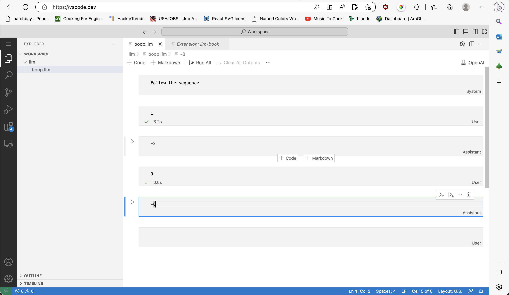

# ai-book README

Interact with LLM's via VS Code notebooks.

To begin, make a `*.llm` file and this extension will automatically take it from there.

As compared to ChatGPT where you only have control over the `user` message, this allows for precisely tuning all of the `system`, `user`, and `assistant` messages to best suit the task at hand (aka "Prompt Engineering"):

## LLaMa?

There is initial support for LLaMa models (anything CLI-powered, really) but it's wonky (the prompt is echoed back in the response, for one). Also, the base LLaMa models aren't well suited for conversational settings, and do not support the `system`, `user`, `assistant` breakdown. If you are interested in furthering this support, PR's are more than welcome. Set `llm-book.LLaMa.binary` to begin.
