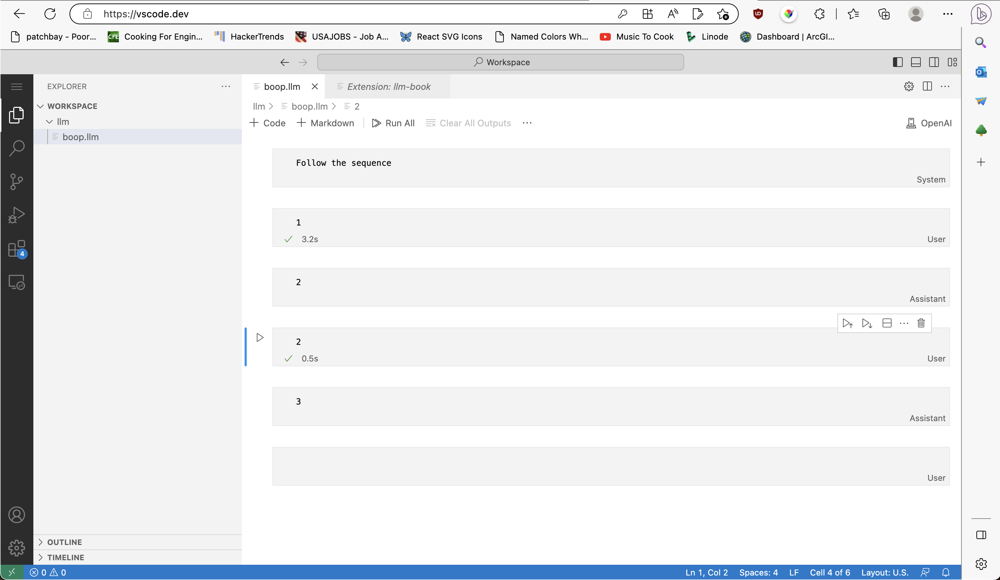
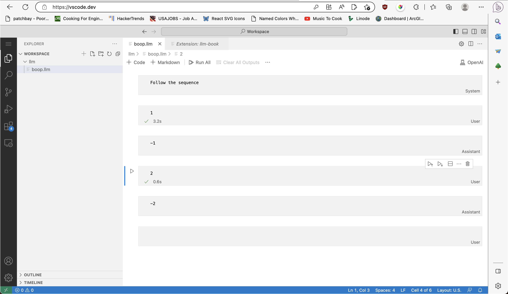

# LLMBook README

Interact with LLM's via VS Code notebooks.

To begin, make a `*.llm` file and this extension will automatically take it from there.

> Note: You can also use `*.llm.json` file, which functions identically but allows importing into scripts without needing to specifically configure a loader.

As compared to ChatGPT where you only have control over the `user` message, this allows for precisely tuning all of the `system`, `user`, and `assistant` messages to best suit the task at hand (aka "Prompt Engineering"):

Fun fact! The `.llm` format used by notebooks is on-disk represented in the official OpenAI "Chat Format" as JSON, meaning the tuned prompt notebook files can be loaded straight from disk and incorporated with the rest of your pipeline.

### Pricing

The extension is free to use. OpenAI isn't. Configure `llm-book.openAI.dollarsPerKiloToken` to show how much a given cell or notebook will cost to execute. Configure `llm-book.openAI.showTokenCount` to hide the token counts on cells and notebooks.

## LLaMa?

There is initial support for LLaMa models (anything CLI-powered, really) but it's wonky (the prompt is echoed back in the response, for one). Also, the base LLaMa models aren't well suited for conversational settings, and do not support the `system`, `user`, `assistant` breakdown. If you are interested in furthering this support, PR's are more than welcome. Set `llm-book.LLaMa.binary` to begin.

## OpenAI?

By default the extension queries against OpenAI APIs (`https://api.openai.com/v1/chat/completions`), however this is easily configured via the `llm-book.openAI.endpoint` setting.
